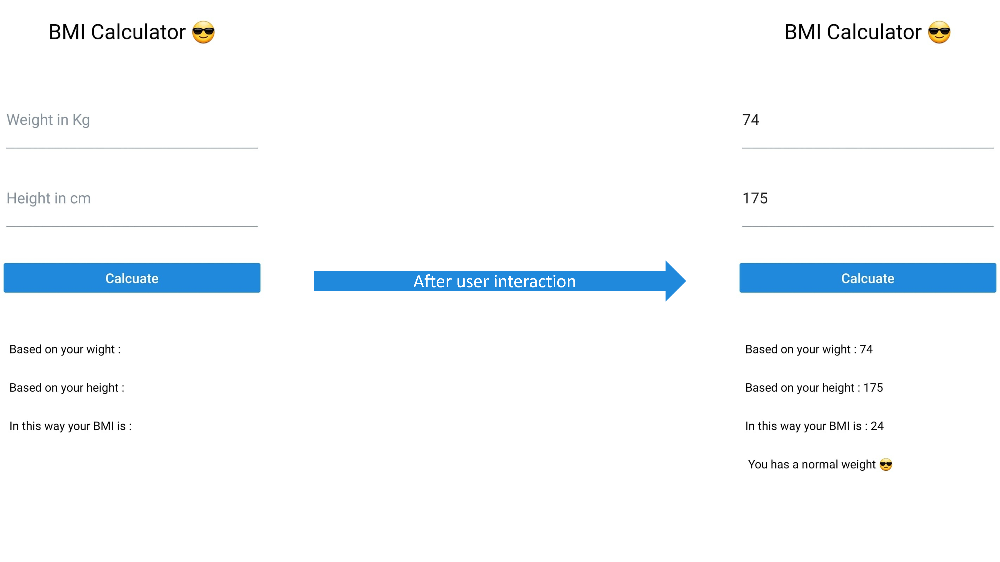

# BMI Calcuater

This is my first app in React Native app, it a simple BMI calcuater. 

## the App 

Everything about this app can be explained by the following image 

The BMI classification is based on the following table
<table border="1">
<tr>
    <td>BMI value</td>
    <td>Calssification</td>
</tr>
<tr>
    <td> less 18.5 </td>
    <td>Under Weight</td>
</tr>
<tr>
    <td> 18.5 - 25</td>
    <td>Normal</td>
</tr>
<tr>
    <td>25-30</td>
    <td>Over Weight</td>
</tr>
<tr>
    <td>30 -35</td>
    <td>Obesity (Class |)</td>
</tr>
<tr>
    <td>35-40</td>
    <td>Obesity (Class ||)</td>
</tr>
<tr>
    <td>Heiger than 40</td>
    <td>Obesity (Class |||)</td>
</tr>
</table>

## Visit my Github: 

<a href="https://www.github.com/Mohmad-Naser-alnakeshbandi" target="_blank" rel="noreferrer">Mohamad Naser Alankeshbandi </a>
